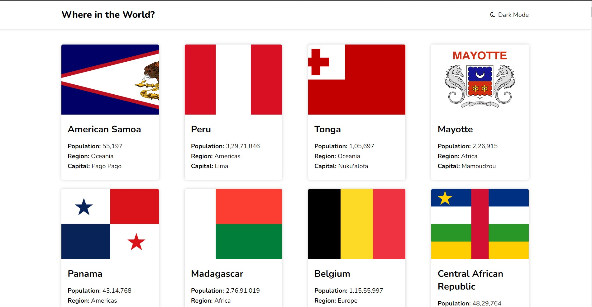

# Country API Project

 

Welcome to the Country API Project! This project utilizes the Countries API to provide information about 150 countries. Users can click on individual country flags to open a new page and view detailed information about the specific country clicked.

## Table of Contents

- [Demo](#demo)
- [Features](#features)
- [Technologies Used](#technologies-used)
- [Setup Instructions](#setup-instructions)
- [Usage](#usage)
- [API Endpoints](#api-endpoints)
- [Contributing](#contributing)
- [License](#license)

## Demo

https://country-a-pi.vercel.app/ 

## Features

- Display a list of 150 countries with their respective flags.
- Clicking on a country flag opens a new page with detailed information about that country.
- Add more features relevant to your project.

## Technologies Used

List the technologies or libraries you used to build this project:

- Frontend: HTML, CSS, JavaScript (or any frameworks/libraries you used)
- Backend: (If applicable, list the backend technologies)
- Countries API (Include the link to the API documentation)

## Setup Instructions

1. Clone the repository: `git clone https://github.com/your-username/country-api-project.git`
2. Navigate to the project directory: `cd country-api-project`
3. Open the index.html file in your web browser.

## Usage

Explain how users can use your application here. Provide examples or screenshots if possible.

## API Endpoints

If you have created any additional API endpoints to enhance the functionality of the Countries API, list and explain them here.

## Contributing

We welcome contributions to improve the Country API Project. If you find any issues or want to add new features, feel free to open an issue or submit a pull request. Follow these steps to contribute:

1. Fork the repository
2. Create a new branch: `git checkout -b feature/your-feature-name`
3. Make your changes and commit them: `git commit -m 'Add some feature'`
4. Push the changes to your branch: `git push origin feature/your-feature-name`
5. Create a pull request

## License

This project is licensed under the [MIT License](LICENSE).

